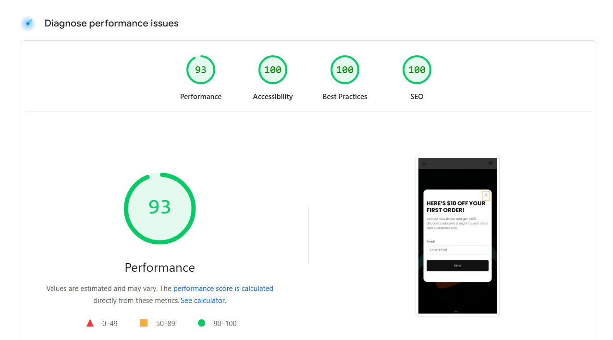

# About project

## Deploy

Deploy link - https://shopify-school-homepage-nazimkov-mykola.onrender.com

Site deployed on https://render.com/

## How to start project

1. Step 1: Install Dependencies

```javascript
npm install
# or
yarn
# or
pnpm install
```

2. Step 2: Run the Development Server

```javascript
npm start
# or
yarn start
# or
pnpm start
```

3. Open page in browser

http://localhost:5173 - open this link in browser

## Project Technology Stack

1.Vite: A next-generation frontend tooling that provides a fast and modern development experience. Vite's blazing-fast dev server and optimized build process were key to ensuring efficient development.
https://vite.dev/

2. SCSS (Sass): A CSS preprocessor that extends the functionality of CSS, allowing for the use of variables, nesting, and mixins. SCSS was used to write more maintainable and organized stylesheets.
   https://sass-lang.com/documentation/

3. JavaScript (ES Modules): The project uses modern JavaScript syntax and ES Modules for a modular and scalable codebase. This approach ensures that the code is well-structured and easy to manage.

4. Swiper slider
   https://swiperjs.com/get-started

## Suggestions for Project Improvements

1. To improve website performance, but now - 93% not bad. 
   https://pagespeed.web.dev/analysis/https-shopify-school-homepage-nazimkov-mykola-onrender-com/dlpg3xlt8x?form_factor=mobile



2. Implement a slider for image previews instead of a static block. I couldn't do it due to conflicts in slider initialization.